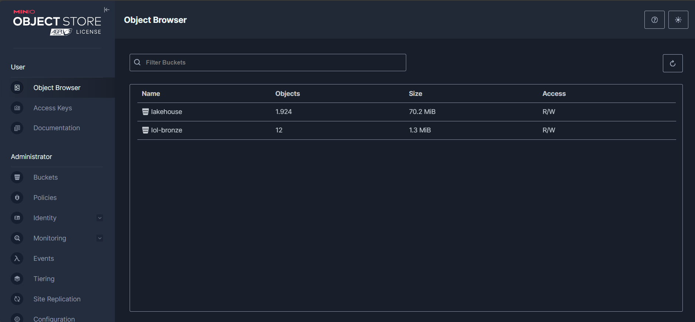
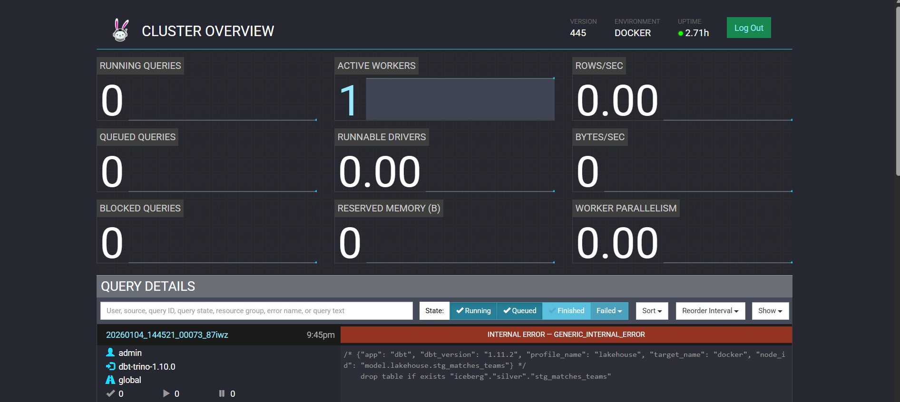
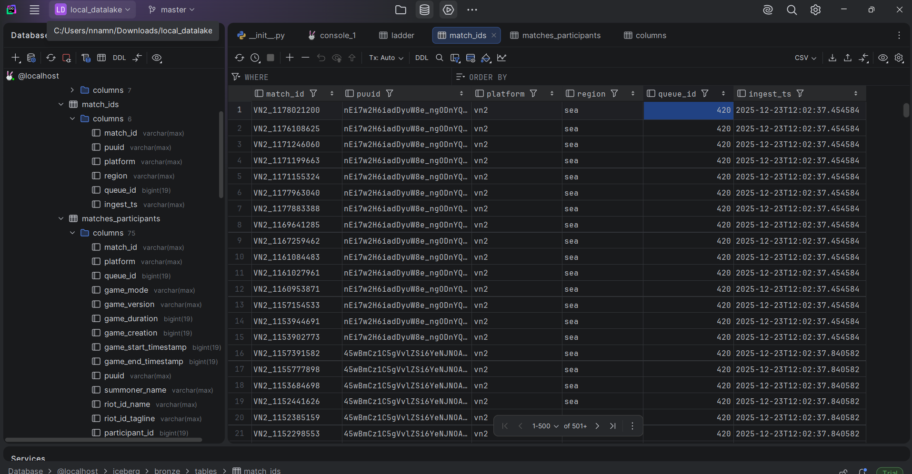
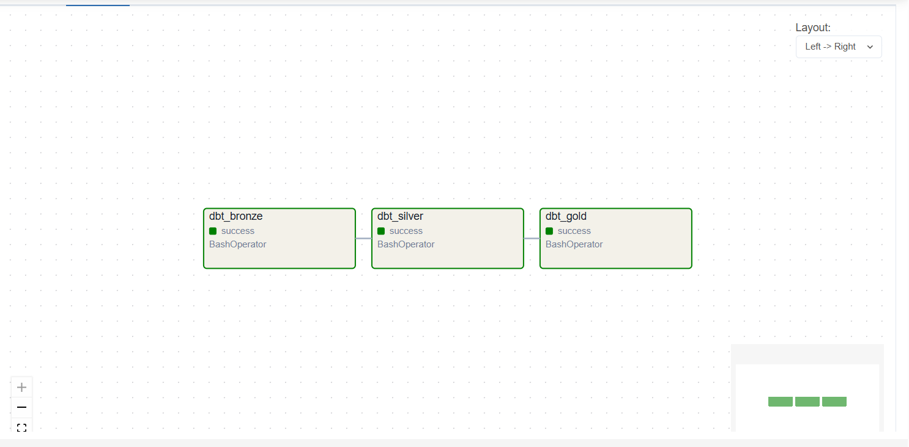

# League of Legends Data Lakehouse

A complete, Docker-based **Modern Data Lakehouse** for analyzing **League of Legends match data** from Riot API using the **Medallion Architecture** (Bronze → Silver → Gold).

---

## Table of Contents

- [Overview](#overview)
- [Project Structure](#project-structure)
- [Architecture](#architecture)
- [Tech Stack](#tech-stack)
- [Quick Start](#quick-start)
- [Implementation](#implementation)
- [Working with the Lakehouse](#working-with-the-lakehouse)
- [Documentation](#documentation)
- [Contributing](#contributing)
- [License](#license)
- [References](#references)

---

## Overview

This project demonstrates how to build a **production-like data lakehouse** on your local machine using open-source technologies. It ingests League of Legends match data from Riot API and transforms it through medallion layers for analytics.

---

## Project Structure

```
local_datalake/
├── docker-compose.yml              # Main service definitions
├── .env                            # 
├── README.md                       # 
│
├── docker/
│   ├── Dockerfile.spark            # Spark + Jupyter image
│   └── Dockerfile.airflow          # Airflow + dbt image
│
├── trino/
│   ├── etc/
│   │   ├── config.properties       # Trino coordinator config
│   │   └── jvm.config              # JVM settings
│   └── catalog/
│       └── iceberg.properties      # Iceberg catalog config
│
├── spark/
│   ├── spark_config.py             # Spark session builder
│   ├── jobs/                       # ETL job scripts
│
├── dbt/
│   ├── dbt_project.yml             # dbt project config
│   ├── profiles.yml                # Connection profiles
│   └── models/
│       ├── schema.yml              # Model documentation & tests
│       ├── bronze/                 # Raw data sources
│       ├── silver/                 # Cleaned staging tables
│       └── gold/                   # Star schema (dim, fct)
│
├── airflow/
│   ├── dags/
│   │   └── pipeline.py             # Main ETL DAG
│   └── logs/                       # Task execution logs
│
├── docs/                           # 
│   └── services/
│
```

---

## Architecture


### Data Flow

#### Chi tiết từng bước:

| Step | Component | Chức năng | Mô tả |
|:----:|-----------|-----------|-------|
| **1** | Python Scripts | Data Extraction | Fetch match data từ Riot API (LEAGUE-V4, MATCH-V5) |
| **2** | MinIO | Object Storage | Lưu raw JSON/Parquet files vào S3-compatible storage |
| **3** | Iceberg REST | Metadata Catalog | Quản lý table schemas, partitions, snapshots |
| **4** | dbt-trino | Transformation | Chuyển đổi dữ liệu Bronze → Silver → Gold bằng SQL |
| **5** | Trino | Query Engine | Thực thi SQL queries, viết Iceberg tables |
| **6** | Airflow | Orchestration | Lên lịch và giám sát pipeline (`@daily`) |
| **7** | Power BI | Visualization | Dashboard phân tích qua JDBC connection |

#### Medallion Layers:

| Layer | Schema | Tables | Format | Mô tả |
|-------|--------|--------|--------|-------|
| **Bronze** | `iceberg.bronze` | `ladder`, `match_ids`, `matches_participants`, `matches_teams` | JSON/Parquet | Dữ liệu raw từ API, không chỉnh sửa |
| **Silver** | `iceberg.silver` | `stg_ladder`, `stg_matches_participants`, `stg_matches_teams` | Iceberg | Dữ liệu đã clean, deduplicate, standardize |
| **Gold** | `iceberg.gold` | `dim_player`, `dim_champion`, `dim_date`, `fct_participant_match` | Iceberg | Star schema cho analytics |

---

## Tech Stack

| Component | Technology | Purpose | Port |
|-----------|------------|---------|------|
| **Object Storage** | MinIO | S3-compatible storage for raw data and Iceberg tables | 9000, 9001 |
| **Table Format** | Apache Iceberg | ACID transactions, schema evolution, time-travel | - |
| **Catalog** | Iceberg REST | Metadata management for Iceberg tables | 8181 |
| **Query Engine** | Trino | Distributed SQL for interactive analytics | 8082 |
| **Transformation** | dbt-trino | Modular SQL transformations | - |
| **Orchestration** | Apache Airflow | DAG scheduling and monitoring | 8083 |
| **ETL Compute** | Apache Spark | Optional ETL for Bronze ingestion | 8888, 8084 |
| **Metadata DB** | PostgreSQL | Backend for Iceberg catalog and Airflow | 5432, 5435 |

---

## Quick Start

### 1. Clone the Repository

```bash
git clone https://github.com/hnmike262/local_datalake.git
cd local_datalake
```

### 2. Create Environment File

```bash
# Create .env file with credentials
# MinIO Credentials
MINIO_ROOT_USER=minioadmin
MINIO_ROOT_PASSWORD=miniopassword123

# AWS S3 (for Iceberg)
AWS_ACCESS_KEY_ID=minioadmin
AWS_SECRET_ACCESS_KEY=miniopassword123
```

### 3. Start All Services

```bash
docker compose up -d
```

### 4. Wait for Services 

```bash
# Check service health
docker compose ps
```

### 5. Access Services

| Service | URL | Credentials |
|---------|-----|-------------|
| MinIO Console | http://localhost:9001 | `minioadmin` / `miniopassword123` |
| Trino Web UI | http://localhost:8082 | No auth required |
| Airflow | http://localhost:8083 | `airflow` / `airflow` |
| Jupyter Notebook | http://localhost:8888 | Token in logs |
| Iceberg REST API | http://localhost:8181 | No auth required |

---

## Implementation

Hướng dẫn chi tiết khởi động và xác minh từng service.

### 1. Riot API (Data Source)

Python scripts fetch data from Riot API.

**Prerequisites:**
- Get API key from [Riot Developer Portal](https://developer.riotgames.com/)
- Add to `.env`: `RIOT_API_KEY=RGAPI-xxxxx`

**Run Scripts:**

```bash
cd data/extraction

# Step 1: Fetch ladder data
python 01_ladder.py --top 500

# Step 2: Fetch match IDs
python 02_matchids.py --count 20

# Step 3: Fetch match details
python 03_matches.py --limit 200

# Step 4: Upload to MinIO
python minio_upload.py
```

→ [Detailed Guide](docs/services/riot-api.md)


### 2. MinIO (Object Storage)

MinIO cung cấp S3-compatible storage cho toàn bộ lakehouse.

**Start Service:**

```bash
docker compose up -d minio
```

**Verify:**

```bash
docker compose ps minio
```

**Expected Output:**

```
NAME    IMAGE          STATUS          PORTS
minio   minio/minio    Up (healthy)    0.0.0.0:9000->9000/tcp, 0.0.0.0:9001->9001/tcp
```

**Access Console:** http://localhost:9001 → Login: `minioadmin` / `miniopassword123`


→ [Detailed Guide](docs/services/minio.md)




### 3. Trino (Query Engine)

Trino là SQL query engine để truy vấn dữ liệu Iceberg.

**Start Service:**

```bash
docker compose up -d iceberg-db iceberg-rest trino
```

**Verify:**

```bash
docker compose ps trino
```

**Expected Output:**

```
NAME    IMAGE                   STATUS          PORTS
trino   trinodb/trino:latest    Up (healthy)    0.0.0.0:8082->8080/tcp
```

**Test CLI:**

```bash
docker exec trino trino --execute "SHOW CATALOGS"
```

**Expected Output:**

```
iceberg
system
```

**Access UI:** http://localhost:8082

 

 

→ [Detailed Guide](docs/services/trino.md)

---

### 4. dbt (Transformations)

dbt xử lý SQL transformations qua các medallion layers.

**Run from lo**

```bash
cd dbt
dbt debug 
```

**Expected Output:**

```
All checks passed!
```

**Run All Models:**

```bash
dbt run --profiles-dir . --target local 
```

**Expected Output:**

```
Completed successfully
Done. PASS=10 WARN=0 ERROR=0 SKIP=0 TOTAL=10
```

**Run Tests:**

```bash
dbt test --profiles-dir . --target local
```


→ [Detailed Guide](docs/services/dbt.md)

---

### 5. Airflow (Orchestration)

Airflow orchestrates the data pipeline, scheduling dbt runs.

**Start Service:**

```bash
docker compose up -d airflow-db airflow
```

**Verify:**

```bash
docker compose ps airflow
```

**Expected Output:**

```
NAME     IMAGE                      STATUS          PORTS
airflow  local_datalake-airflow     Up (healthy)    0.0.0.0:8083->8080/tcp
```

**Access UI:** http://localhost:8083 → Login: `admin` / `admin`

**Trigger DAG:**

```bash
docker exec airflow airflow dags trigger pipeline
```

**Check DAG Runs:**

```bash
docker exec airflow airflow dags list-runs -d pipeline
```



→ [Detailed Guide](docs/services/airflow.md)

---


## Documentation

Detailed guides in `docs/` folder:

| Topic | Description | Link |
|-------|-------------|------|
| **Architecture** | System design, Medallion layers | [docs/architecture.md](docs/architecture.md) |
| **Data Pipeline** | Bronze → Silver → Gold flow | [docs/data-pipeline.md](docs/data-pipeline.md) |
| **dbt Models** | Model structure, dependencies | [docs/dbt-models.md](docs/dbt-models.md) |
| **Step-by-Step Setup** | Detailed setup instructions | [docs/step-by-step-setup.md](docs/step-by-step-setup.md) |
| **Troubleshooting** | Common issues and fixes | [docs/troubleshooting.md](docs/troubleshooting.md) |

### Service Guides

| Service | Link |
|---------|------|
| MinIO | [docs/services/minio.md](docs/services/minio.md) |
| Iceberg | [docs/services/iceberg.md](docs/services/iceberg.md) |
| Trino | [docs/services/trino.md](docs/services/trino.md) |
| Spark | [docs/services/spark.md](docs/services/spark.md) |
| Airflow | [docs/services/airflow.md](docs/services/airflow.md) |
| dbt | [docs/services/dbt.md](docs/services/dbt.md) |

---

## Power BI


---

## License

This project is licensed under the MIT License - see the [LICENSE](LICENSE) file for details.

---

## References

- [Apache Iceberg Documentation](https://iceberg.apache.org/docs/latest/)
- [Trino Documentation](https://trino.io/docs/current/)
- [dbt Documentation](https://docs.getdbt.com/)
- [MinIO Documentation](https://min.io/docs/minio/linux/index.html)
- [Airflow Documentation](https://airflow.apache.org/docs/)
- [Riot API Documentation](https://developer.riotgames.com/docs/lol)
