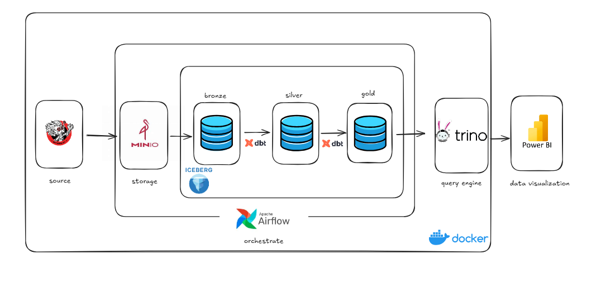

# Services Setup Guide

Hướng dẫn đầy đủ cách thiết lập môi trường và kết nối các services trong Data Lakehouse.

---

## Table of Contents

1. [Tổng Quan Kiến Trúc](#1-tổng-quan-kiến-trúc)
2. [Thứ Tự Khởi Động Services](#2-thứ-tự-khởi-động-services)
3. [Setup Từng Service](#3-setup-từng-service)
4. [Kết Nối Giữa Các Services](#4-kết-nối-giữa-các-services)
5. [Verification Checklist](#5-verification-checklist)
6. [Commands Reference](#6-commands-reference)

---

## 1. Tổng Quan Kiến Trúc

### Services và Vai Trò

| Service | Vai Trò | Port | Phụ Thuộc |
|---------|---------|------|-----------|
| **MinIO** | Object Storage (S3) | 9000, 9001 | - |
| **PostgreSQL (iceberg-db)** | Metadata cho Iceberg Catalog | 5432 | - |
| **Iceberg REST** | Quản lý metadata tables | 8181 | MinIO, iceberg-db |
| **Trino** | SQL Query Engine | 8082 | Iceberg REST, MinIO |
| **Spark** | ETL/Ingestion Engine | 8888, 8084 | Iceberg REST, MinIO |
| **PostgreSQL (airflow-db)** | Metadata cho Airflow | 5435 | - |
| **Airflow** | Orchestration | 8083 | airflow-db, Trino |
| **dbt** | Transformation (SQL) | - | Trino |

### Data Flow


---

## 2. Thứ Tự Khởi Động Services


```
Layer 1: Storage & Databases
├── minio              # Object storage
├── iceberg-db         # PostgreSQL for Iceberg
└── airflow-db         # PostgreSQL for Airflow

Layer 2: Catalog
└── iceberg-rest       # Depends on: minio, iceberg-db

Layer 3: Compute
├── trino              # Depends on: iceberg-rest, minio
└── spark              # Depends on: iceberg-rest, minio

Layer 4: Orchestration
└── airflow            # Depends on: airflow-db, trino
```

### Quick Start (All Services)

```bash
# Clone repository
git clone https://github.com/hnmike262/local_datalake.git
cd local_datalake

# Create .env file
MINIO_ROOT_USER=minioadmin
MINIO_ROOT_PASSWORD=miniopassword123
AWS_ACCESS_KEY_ID=minioadmin
AWS_SECRET_ACCESS_KEY=miniopassword123


# Start all services
docker compose up -d

# Wait 2-3 minutes, then verify
docker compose ps
```

---

## 3. Setup Từng Service

### 3.1 MinIO (Object Storage)

**Start:**
```bash
docker compose up -d minio
```

**Console:**
- Mở: http://localhost:9001
- Login: `minioadmin` / `miniopassword123`

**Verify buckets:**
```bash
aws --endpoint-url http://localhost:9000 s3 ls
```

---

### 3.2 Trino (Query Engine)

**Start:**
```bash
docker compose up -d trino
```

**Verify catalogs:**
```bash
docker exec trino trino --execute "SHOW CATALOGS"
```

**Verify schemas:**
```bash
docker exec trino trino --execute "SHOW SCHEMAS FROM iceberg"
```

**Verify Web UI:**
- Mở: http://localhost:8082

---

### 3.3 Airflow (Orchestration)

**Start:**
```bash
docker compose up -d airflow
```

**Verify DAGs:**
```bash
docker exec -it airflow airflow dags list
```


**Verify dbt trong Airflow:**
```bash
docker exec -it airflow dbt --version
```


**Verify Web UI:**
- Mở: http://localhost:8083
- Login: `admin` / `admin`

---

### 3.4 dbt (Transformation)

**Verify từ Airflow container:**
```bash
docker exec -it airflow bash -c "cd /opt/dbt && dbt debug --profiles-dir . --target docker"
```


**Verify từ host (nếu có dbt-trino):**
```bash
cd dbt
dbt debug --profiles-dir . --target local
```

---

## 4. Kết Nối Giữa Các Services

### 4.1 MinIO Connections

| From | To MinIO | Protocol | Config Location |
|------|----------|----------|-----------------|
| Python Scripts | `localhost:9000` | S3 API | Script code |
| Iceberg REST | `minio:9000` | S3 API | docker-compose.yml |
| Trino | `minio:9000` | S3 API | trino/catalog/iceberg.properties |
| Spark | `minio:9000` | s3a:// | spark_config.py |

**Verify từ Trino:**
```bash
docker exec -it trino curl http://minio:9000/minio/health/live
```

---

### 4.2 Iceberg REST Connections

| From | To Iceberg REST | Protocol | Config Location |
|------|-----------------|----------|-----------------|
| Trino | `iceberg-rest:8181` | REST | trino/catalog/iceberg.properties |
| Spark | `iceberg-rest:8181` | REST | spark_config.py |

**Verify từ Trino:**
```bash
docker exec -it trino curl http://iceberg-rest:8181/v1/config
```

---

### 4.3 Trino Connections

| From | To Trino | Protocol | Config Location |
|------|----------|----------|-----------------|
| dbt (docker) | `trino:8080` | HTTP | dbt/profiles.yml |
| dbt (local) | `localhost:8082` | HTTP | dbt/profiles.yml |
| Airflow | `trino:8080` | HTTP | Via dbt |
| Power BI | `localhost:8082` | ODBC | Driver config |

**Verify dbt → Trino:**
```bash
docker exec -it airflow bash -c "cd /opt/dbt && dbt debug --profiles-dir . --target docker"
```

---

## 6. Commands Reference

### Start/Stop Commands

| Action | Command |
|--------|---------|
| Start all | `docker compose up -d` |
| Stop all | `docker compose down` |
| Stop + remove volumes | `docker compose down -v` |
| Restart service | `docker compose restart <service>` |
| View logs | `docker compose logs <service> -f` |
| Check status | `docker compose ps` |

### Service-Specific Commands

| Service | Check Health | Access CLI |
|---------|--------------|------------|
| MinIO | `curl http://localhost:9000/minio/health/live` | `docker exec -it minio mc` |
| Iceberg | `curl http://localhost:8181/v1/config` | N/A |
| Trino | `curl http://localhost:8082/v1/info` | `docker exec -it trino trino` |
| Spark | `curl http://localhost:8888` | `docker exec -it spark python` |
| Airflow | `curl http://localhost:8083/health` | `docker exec -it airflow airflow` |
| dbt | N/A | `docker exec -it airflow bash -c "cd /opt/dbt && dbt"` |


### Query Data

```bash
# Query Bronze
docker exec trino trino --execute "SELECT COUNT(*) FROM iceberg.bronze.ladder"

# Query Silver
docker exec trino trino --execute "SELECT COUNT(*) FROM iceberg.silver.stg_ladder"

# Query Gold
docker exec trino trino --execute "SELECT * FROM iceberg.gold.dim_champion LIMIT 5"
```

---

## Service Documentation Links

| Service | Detailed Guide |
|---------|----------------|
| MinIO | [minio.md](minio.md) |
| Iceberg | [iceberg.md](iceberg.md) |
| Trino | [trino.md](trino.md) |
| Spark | [spark.md](spark.md) |
| Airflow | [airflow.md](airflow.md) |
| dbt | [dbt.md](dbt.md) |

---

[← Back to Main README](../../README.md)
