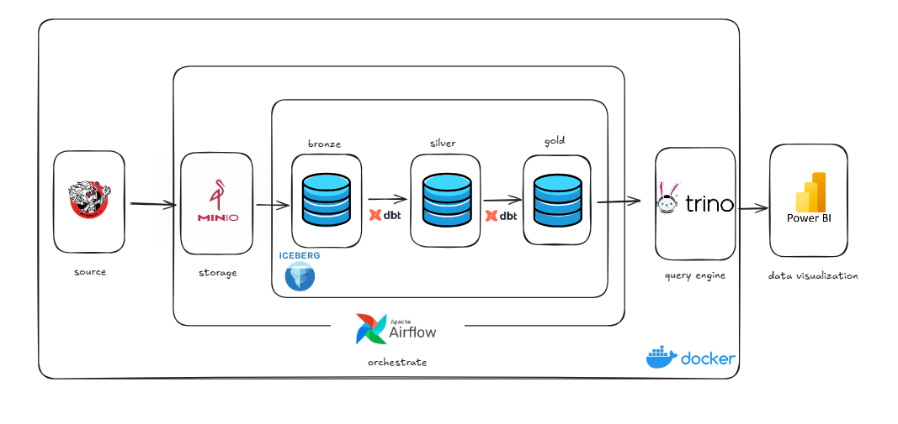

# Services Setup Guide

Hướng dẫn đầy đủ cách thiết lập môi trường và kết nối các services trong Data Lakehouse.

---

## Table of Contents

1. [Tổng Quan Kiến Trúc](#1-tổng-quan-kiến-trúc)
2. [Thứ Tự Khởi Động Services](#2-thứ-tự-khởi-động-services)
3. [Setup Từng Service](#3-setup-từng-service)
4. [Kết Nối Giữa Các Services](#4-kết-nối-giữa-các-services)
5. [Verification Checklist](#5-verification-checklist)
6. [Commands Reference](#6-commands-reference)
7. [Troubleshooting](#7-troubleshooting)

---

## 1. Tổng Quan Kiến Trúc

### Services và Vai Trò

| Service | Vai Trò | Port | Phụ Thuộc |
|---------|---------|------|-----------|
| **MinIO** | Object Storage (S3-compatible) - Lưu trữ file Parquet/Iceberg | 9000, 9001 | - |
| **PostgreSQL (iceberg-db)** | Metadata database cho Iceberg Catalog | 5432 | - |
| **Iceberg REST** | Quản lý metadata tables (schema, snapshot, partition) | 8181 | MinIO, iceberg-db |
| **Trino** | SQL Query Engine - Thực thi SQL trên Iceberg tables | 8082 | Iceberg REST, MinIO |
| **Spark** | ETL/Ingestion Engine - Load data vào Bronze | 8888, 8084 | Iceberg REST, MinIO |
| **PostgreSQL (airflow-db)** | Metadata database cho Airflow | 5435 | - |
| **Airflow** | Orchestration - Lên lịch và giám sát pipeline | 8083 | airflow-db, Trino |
| **dbt** | Transformation - SQL models (Bronze → Silver → Gold) | - | Trino |

### Data Flow

```
Riot API → Python Scripts → MinIO (lol-bronze)
                              ↓
                        Spark/Trino
                              ↓
                    Iceberg Tables (lakehouse)
                              ↓
                 dbt: Bronze → Silver → Gold
                              ↓
                         Power BI
```



---

## 2. Thứ Tự Khởi Động Services

```
Layer 1: Storage & Databases (Khởi động đầu tiên)
├── minio              # Object storage - lưu data files
├── iceberg-db         # PostgreSQL for Iceberg metadata
└── airflow-db         # PostgreSQL for Airflow metadata

Layer 2: Catalog (Phụ thuộc Layer 1)
└── iceberg-rest       # REST API quản lý Iceberg tables
                       # Depends on: minio, iceberg-db

Layer 3: Compute (Phụ thuộc Layer 2)
├── trino              # SQL query engine
│                      # Depends on: iceberg-rest, minio
└── spark              # ETL compute engine
                       # Depends on: iceberg-rest, minio

Layer 4: Orchestration (Phụ thuộc Layer 3)
└── airflow            # DAG scheduler
                       # Depends on: airflow-db, trino
```

### Quick Start (All Services)

```bash
# 1. Clone repository
git clone https://github.com/hnmike262/local_datalake.git
cd local_datalake

# 2. Tạo file .env
cat > .env << 'EOF'
MINIO_ROOT_USER=minioadmin
MINIO_ROOT_PASSWORD=miniopassword123
AWS_ACCESS_KEY_ID=minioadmin
AWS_SECRET_ACCESS_KEY=miniopassword123
EOF

# 3. Start all services
docker compose up -d

# 4. Đợi 2-3 phút để services healthy, kiểm tra status
docker compose ps
```

**Expected Output:**
```
NAME           STATUS          PORTS
airflow        Up (healthy)    0.0.0.0:8083->8080/tcp
airflow-db     Up (healthy)    0.0.0.0:5435->5432/tcp
iceberg-db     Up (healthy)    0.0.0.0:5432->5432/tcp
iceberg-rest   Up (healthy)    0.0.0.0:8181->8181/tcp
minio          Up (healthy)    0.0.0.0:9000-9001->9000-9001/tcp
spark          Up (healthy)    0.0.0.0:8888->8888/tcp
trino          Up (healthy)    0.0.0.0:8082->8080/tcp
```

---

## 3. Setup Từng Service

### 3.1 MinIO (Object Storage)

**Mục đích:** Lưu trữ raw data (Parquet) và Iceberg table files.

**Start:**
```bash
docker compose up -d minio minio-init
```

**Verify health:**
```bash
curl -s http://localhost:9000/minio/health/live
# Output: (empty = healthy)
```

**Console:**
- URL: http://localhost:9001
- Login: `minioadmin` / `miniopassword123`

**Verify buckets:**
```bash
# Kiểm tra bucket đã được tạo
docker exec minio mc ls local
# Expected: lakehouse bucket
```

---

### 3.2 Iceberg REST Catalog

**Mục đích:** Quản lý metadata của Iceberg tables (schema, partitions, snapshots).

**Start:**
```bash
docker compose up -d iceberg-db iceberg-rest
```

**Verify health:**
```bash
curl -s http://localhost:8181/v1/config
# Output: {"defaults":{},"overrides":{"namespace-separator":"%2E"},...}
```

**Ý nghĩa:** Nếu trả về JSON config → Iceberg REST đang hoạt động.

---

### 3.3 Trino (Query Engine)

**Mục đích:** SQL engine để query và transform data trên Iceberg tables.

**Start:**
```bash
docker compose up -d trino
```

**Verify catalogs:**
```bash
docker exec trino trino --execute "SHOW CATALOGS"
```

**Ý nghĩa:** 
- `iceberg` = Iceberg catalog kết nối MinIO
- `system` = Trino internal catalog

**Verify schemas:**
```bash
docker exec trino trino --execute "SHOW SCHEMAS FROM iceberg"

```

**Ý nghĩa:** 3 schemas của Medallion Architecture đã sẵn sàng.

**Web UI:** http://localhost:8082

---

### 3.4 Airflow (Orchestration)

**Mục đích:** Lên lịch và giám sát ETL pipeline.

**Start:**
```bash
docker compose up -d airflow-db airflow
```

**Verify DAGs:**
```bash
docker exec airflow airflow dags list

```

**Ý nghĩa:** DAG `pipeline` đã được load và sẵn sàng chạy.

**Verify dbt trong Airflow:**
```bash
docker exec airflow dbt --version
```

**Web UI:**
- URL: http://localhost:8083
- Login: `admin` / `admin`

---

### 3.5 dbt (Transformation)

**Mục đích:** SQL transformations qua Medallion layers (Bronze → Silver → Gold).

**Verify connection:**
```bash
docker exec airflow bash -c "cd /opt/dbt && dbt debug --profiles-dir . --target docker"
```

**Expected Output:**
```
Configuration:
  profiles.yml file [OK found and valid]
  dbt_project.yml file [OK found and valid]
Connection:
  host: trino
  port: 8080
  Connection test: [OK connection ok]
```

**Ý nghĩa:** dbt đã kết nối được với Trino.

---

## 4. Kết Nối Giữa Các Services

### 4.1 Network Diagram

```
┌─────────────────────────────────────────────────────────────┐
│                    Docker Network: lakehouse                 │
│                                                              │
│  ┌─────────┐    ┌──────────────┐    ┌─────────┐            │
│  │  MinIO  │◄───│ Iceberg REST │◄───│  Trino  │            │
│  │  :9000  │    │    :8181     │    │  :8080  │            │
│  └─────────┘    └──────────────┘    └────┬────┘            │
│       ▲                                   │                 │
│       │              ┌────────────────────┘                 │
│       │              ▼                                      │
│  ┌─────────┐    ┌─────────┐    ┌─────────────┐             │
│  │  Spark  │    │   dbt   │◄───│   Airflow   │             │
│  │  :8888  │    │ (in AF) │    │    :8080    │             │
│  └─────────┘    └─────────┘    └─────────────┘             │
│                                                              │
└─────────────────────────────────────────────────────────────┘
                              │
            ┌─────────────────┼─────────────────┐
            ▼                 ▼                 ▼
      localhost:9001   localhost:8082    localhost:8083
      (MinIO Console)  (Trino UI)        (Airflow UI)
```

### 4.2 Connection Details

| From | To | Internal URL | External URL |
|------|-----|--------------|--------------|
| Iceberg REST | MinIO | `http://minio:9000` | `http://localhost:9000` |
| Trino | Iceberg REST | `http://iceberg-rest:8181` | `http://localhost:8181` |
| Trino | MinIO | `http://minio:9000` | `http://localhost:9000` |
| dbt (docker) | Trino | `http://trino:8080` | - |
| dbt (local) | Trino | - | `http://localhost:8082` |
| Power BI | Trino | - | `jdbc:trino://localhost:8082` |


---

## 6. Commands Reference

### 6.1 Docker Compose Commands

| Action | Command | Giải thích |
|--------|---------|------------|
| Start all | `docker compose up -d` | Khởi động tất cả services ở background |
| Stop all | `docker compose down` | Dừng và xóa containers (giữ volumes) |
| Stop + remove data | `docker compose down -v` | Dừng và xóa cả volumes (MẤT DATA!) |
| Restart service | `docker compose restart <service>` | Restart 1 service cụ thể |
| View logs | `docker compose logs <service> -f` | Xem logs realtime |
| Check status | `docker compose ps` | Xem trạng thái tất cả services |
| Rebuild | `docker compose build --no-cache` | Build lại images |

### 6.2 Service Health Commands

| Service | Command | Expected Output |
|---------|---------|-----------------|
| MinIO | `curl http://localhost:9000/minio/health/live` | Empty (healthy) |
| Iceberg | `curl http://localhost:8181/v1/config` | JSON config |
| Trino | `curl http://localhost:8082/v1/info` | JSON with uptime |
| Airflow | `curl http://localhost:8083/health` | JSON health status |
| Spark | `curl http://localhost:8888` | HTML page |

### 6.3 Trino SQL Commands

```bash
# Chạy SQL query
docker exec trino trino --execute "YOUR SQL HERE"

# Mở Trino CLI interactive
docker exec -it trino trino

# Ví dụ queries
docker exec trino trino --execute "SHOW CATALOGS"
docker exec trino trino --execute "SHOW SCHEMAS FROM iceberg"
docker exec trino trino --execute "SHOW TABLES FROM iceberg.bronze"
docker exec trino trino --execute "SELECT * FROM iceberg.gold.dim_champion LIMIT 5"
docker exec trino trino --execute "DESCRIBE iceberg.gold.fct_participant_match"
```

### 6.4 dbt Commands

```bash
# Chạy từ Airflow container
docker exec airflow bash -c "cd /opt/dbt && dbt <command> --profiles-dir . --target docker"

# Các commands thường dùng
dbt debug          # Test connection
dbt run            # Chạy tất cả models
dbt run --threads 1  # Chạy tuần tự (KHUYẾN NGHỊ)
dbt test           # Chạy data tests
dbt docs generate  # Tạo documentation
dbt docs serve     # Serve docs locally

# Chạy specific models
dbt run --select stg_ladder                    # 1 model
dbt run --select path:models/silver            # Tất cả Silver
dbt run --select +fct_participant_match        # Model + dependencies
```

### 6.5 Airflow Commands

```bash
# Chạy từ host
docker exec airflow airflow <command>

# Các commands thường dùng
airflow dags list              # List all DAGs
airflow dags trigger pipeline  # Trigger DAG manually
airflow dags list-runs -d pipeline  # Xem run history
airflow tasks list pipeline    # List tasks in DAG
```

---

## 7. Troubleshooting

### 7.1 Common Issues

| Issue | Cause | Solution |
|-------|-------|----------|
| `SQLITE_BUSY: database is locked` | Concurrent writes to Iceberg | Chạy `dbt run --threads 1` |
| `Content-Md5 header missing` | MinIO/Iceberg version mismatch | Warning only, không ảnh hưởng |
| Service not healthy | Dependencies chưa ready | Đợi 2-3 phút, check logs |
| `Catalog iceberg does not exist` | Trino chưa connect được Iceberg | Restart iceberg-rest, trino |
| dbt connection failed | Trino chưa healthy | Check `docker compose ps trino` |

### 7.2 Reset Everything

```bash
# Dừng tất cả và xóa data (CẢNH BÁO: MẤT HẾT DATA!)
docker compose down -v

# Xóa orphan containers
docker compose down --remove-orphans

# Start fresh
docker compose up -d
```

### 7.3 View Logs

```bash
# Xem logs của service cụ thể
docker compose logs trino -f
docker compose logs iceberg-rest -f
docker compose logs airflow -f

# Xem logs có error
docker compose logs iceberg-rest 2>&1 | grep -i error
```

---

## Service Documentation Links

| Service | Detailed Guide |
|---------|----------------|
| MinIO | [minio.md](minio.md) |
| Trino + Iceberg | [trino.md](trino.md) |
| Airflow | [airflow.md](airflow.md) |
| dbt | [dbt.md](dbt.md) |
| Riot API | [riot-api.md](riot-api.md) |

---

[← Back to Main README](../../README.md)
